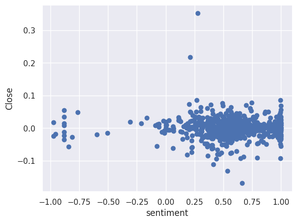
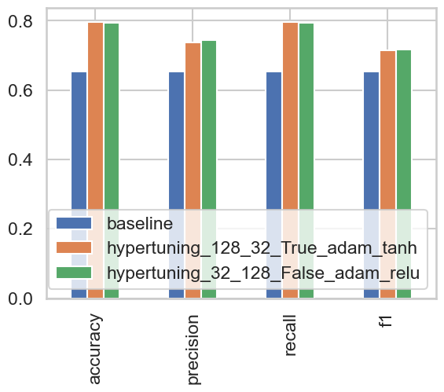
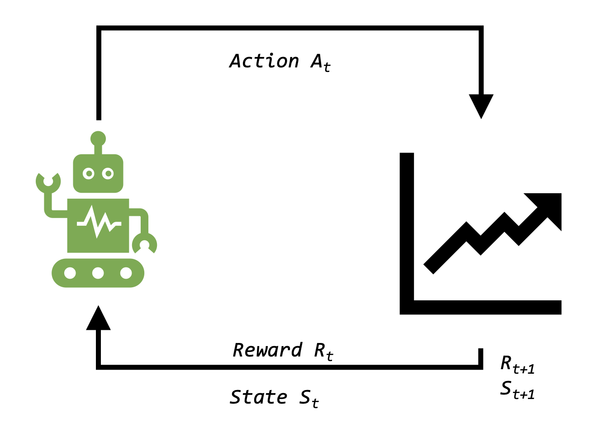
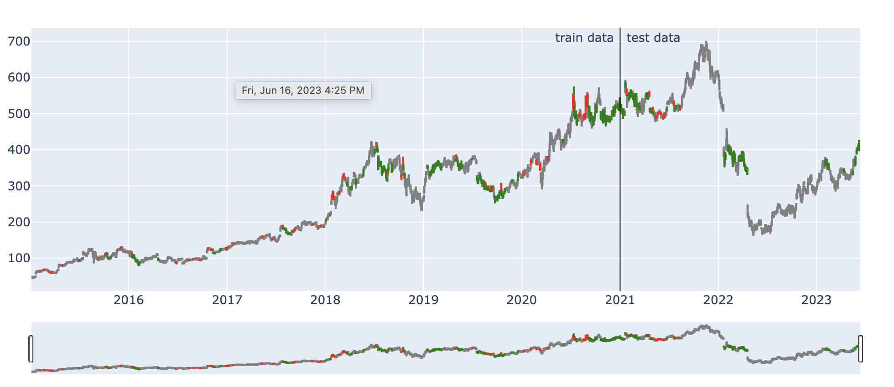
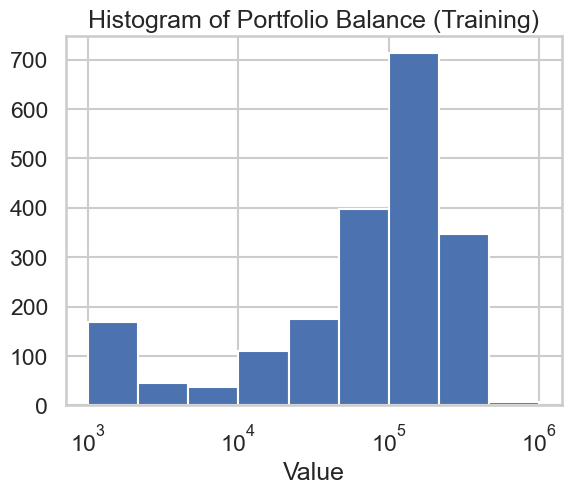
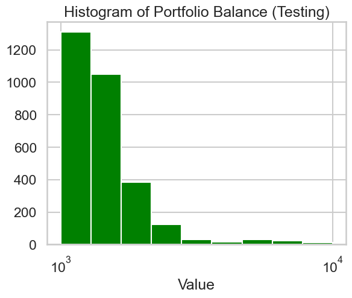

# Stock Prediction with Deep Learning and Reinforcement Learning

Forecasting the price movement of Stock (use case NFLX) using deep learning and reinforcement learning techniques. Also includes topical analysis of social media and news data, to see influence, if any on price movement.
<candle stick>

## Objectives

- Build a Neural network classifier algorithm to forecast daily price movements of the NFLX stock ticker and evaluate its performance.
  -- Scrape social media data related to of NFLX, perform topical analysis, and use as a feature for the model if applicable.
- Build a Reinforcement-learning model that will trade on NFLX stock and compensate for the shortcomings of the above.

## Neutral Network Classifier

Predicting the stock movement is a time-series problem. The target is the forecasted relative change of the _Close_ price of the stock (i.e. difference/previous value). The following features were considered as inputs into the model. The first four are strictly financial indicators, while the last 2 are not.

1. Daily trade volume.
2. EPS - Earnings per share
3. Period in the quarter-to-quarter cycle
4. The SPX 500 equity index
5. Social Media (trending topics and sentiment analysis)
6. Netflix Top 10 trending clusters (unsupervised learning with KMeans clustering)

### Feature Engineering

Financial data was downloaded from AlphaQuery. The Top 10 Netflix [dataset](https://www.kaggle.com/datasets/dhruvildave/netflix-top-10-tv-shows-and-films) up to August 2022 was got from Kaggle. I populated the rest of the dataset through web scraping. Gathering social media data was non-trivial and involved scraping the Reddit.com API for posts and comments from the [Netflix subreddit](https://www.reddit.com/r/netflix/). This data was cleaned and then used to build the corpus of a Gensim's LDA model. The model was fitted on the corpus, optimized coherence values and produced 4 topic clusters.

However analysis during feature engineering showed that this feature was statistically insignificant towards predicting the price movement of NFLX.

Similarly the EPS and Days from last Quarter end were also discovered to have no effect on the price movement. The final version of the model only had the following inputs: the _Volume_ of trade, and its _Close_ price history over a window of 3 days. Similarly, the _SPX_ price history over the same window of 3 days.

There are 3 target labels:

1. No significant change (between -2% and 2%)
2. A positive change (bullish bukk🐂) of above 2%
3. A negative change (bearish🐻) of below 2%

### Results

The process of developing an appropriate deep learning model involved building and testing models of increasing complexity. From a simple one-hidden layer Dense network, to a 3-layer LSTM NN with drop-out layers. A final model, with LSTM and CNN layers were chosen, and vigorous hyper parameter tuning was performed to select the best performance. Two configurations were discovered to give the best results (the first is illustrated):

- 'hypertuning_32_128_False_adam_relu': - 128 LSTM nodes, Batch size 32, No CNN layer, 'Adam' optimizer, 'Relu' activation in the LSTM layer.
- 'hypertuning_128_32_True_adam_tanh': - 32 LSTM nodes, Batch size 128, 1 CNN layer, 'Adam' optimizer, 'Tanh' Activation

### Observations

They both beat the Naive, next-day-prediction baseline performance.
However the low Recall and Precision of the non-stationary classes indicates that the model is essentially unreliable.

### Deployment

The classifier model broadcasts its results at the end of US market day via flask-based app running on an AWS EC2 instance.

[NFLX Ticker Genie](http://ec2-18-220-177-255.us-east-2.compute.amazonaws.com:8000/)

## Reinforcement Learning

The unpredictability of the stock market makes it a popular candidate for reinforcement learning. Following the Markov Decision Process, I imitated OpenGym AI's popular reinforcement learning API.

1. $S$ set of states in environment E. For this problem, the Environment is the price history of the NFLX ticker. The state space is defined by the _Cash Balance_, _Price of NFLX shares_, _Number of NFLX shares owned_.
2. $A$ set of actions available to the agent. In this case, 3 discrete actions of _0_ Hold, _1_ Buy, _2_ Sell.
3. $Ra (s, s')$ - reward received for transitioning from state $s$ to state $s'$. The reward schedule is the profit made in each step i.e. the _current_portfolio_balance_ - _previous_portfolio_balance_.
4. $P_a(s, s') = Pr(s_{t+1} = s'|s_{t} = s, a_{t} = a)$, the probability that action $a$ in state $s$ at time $t$ will lead to state $s'$ at time $t+1$. An LSTM NN model is trained to find the best policy ($pi$) that maximizes the rewards of the action/state pairs.

In both the training and test modes, the agent iterates through the price history to complete one episode. In training mode, the model is trained, using the action/space pairs of the agent as the input and the resulting rewards as outcome. During testing, the model's weights are frozen and the agent's performances are observed. The chart below shows the average (mode) decision made by the agent during the NFLX price history 'lifetime'.

### Results

By defaut, each episode starts with a cash balance of 1000 cash units. The training was done over 3000 epochs. The testing was done for 1000 epochs. The average portfolio balances at the end of each episode is shown below.

(_Note the logarithmic scale? Now imagine if that was real money!_)

## Conclusion

- A lot of effort is put into feature engineering... only to discover that the feature is of no value to the present model.
- Time series problems have unique challenges.
- Regardless of how sophisticated the architecture of a supervised learning model is, it remains only as good as the features/input parameters it was given.
- Reinforcement learning allows the algorithm to discover patterns and strategies with less restriction. The potentials for this aspect of AI is quite exciting.

### Future Work

- Develop the model to trade across a multi-stock platform. Deploy in real-time (for personal use only!)
